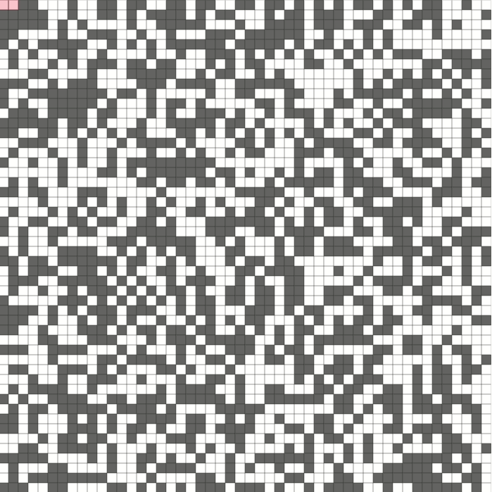

# Modified A* search
Using the generic A* algorithm with a local, limited depth, breadth first search, to boost search speed.

The final result looks as follows :

Many parameters can be tweaked in order to get the optimal path:
1. depth parameter of the local breadth first search [here](https://github.com/ChiragKr/modified-astar/blob/e8e35047894221925b41bfec3898e8323bc290fe/astar.js#L72)
2. heuristic function for the A* [here](https://github.com/ChiragKr/modified-astar/blob/e8e35047894221925b41bfec3898e8323bc290fe/astar.js#L160)

Different permutations of the above parameters result in different approachs.
* Changing the depth to 1 would result in a traditional A*.
* Changing "heuristic" to "no_heuristic" would result in a dijkstra with limited depth BFS.
* Changing depth to 1 and using "no_heuristic" would result in traditional Dijkstra.
